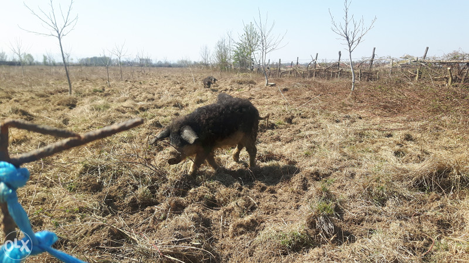
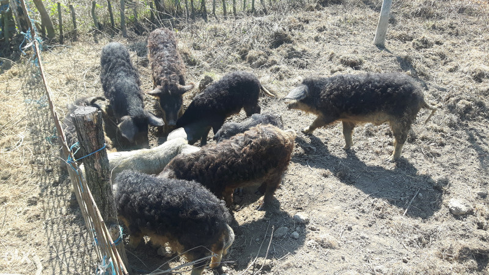
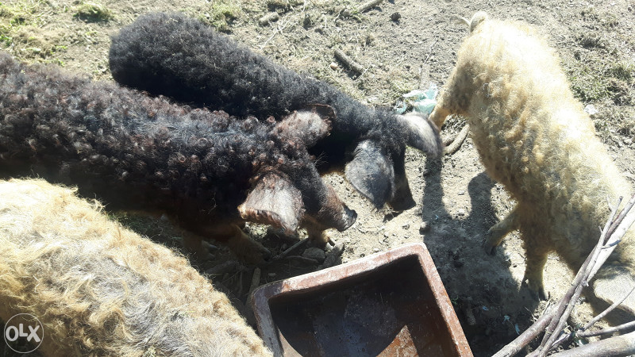
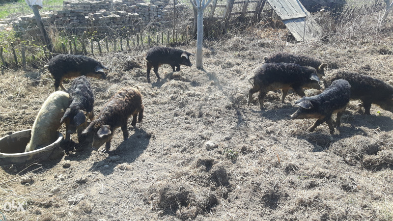
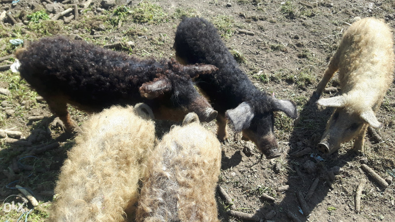
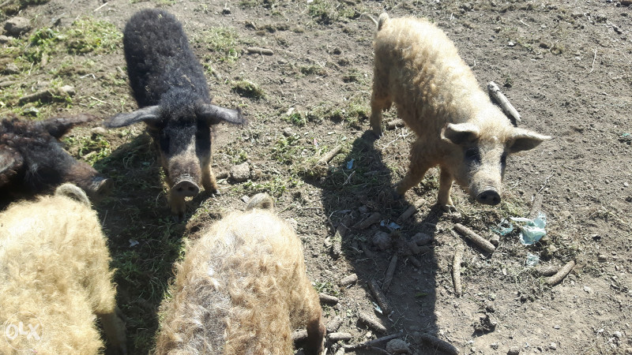
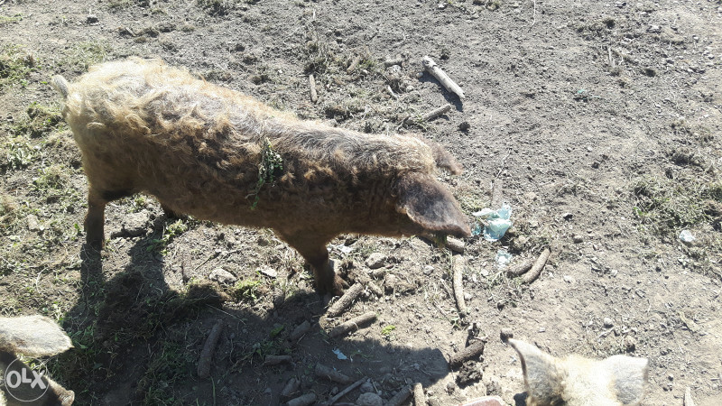

<!DOCTYPE html>
<html>
<head>
	<meta charset="utf-8">
	<meta name="viewport" content="width=device-width, initial-scale=1.0" />
	<link rel="stylesheet" type="text/css" href="style.css">
	<link rel="preconnect" href="https://fonts.gstatic.com">
<link href="https://fonts.googleapis.com/css2?family=Raleway:wght@500&display=swap" rel="stylesheet">
<link rel="preconnect" href="https://fonts.gstatic.com">
<link href="https://fonts.googleapis.com/css2?family=Roboto&display=swap" rel="stylesheet">
	<title></title>
</head>
<body>
	<nav>
		

			<a href="#layer-main">
			<h3>Mangulice</h3></a>
			
			<ul>
				<li><a href="#about">O mangulicama</a></li>
				<li><a href="#gallery">Galerija</a></li>
				<li><a href="#contact">Kontakt</a></li>
			</ul>
			
Logo created and designed using Logomakr.com  Srbislav Vučenović 2020. &copy

		

	</nav>
	<main>
		
		

			

				<h2>Dobrodošli!</h2>
				
Saznajte više o mangulicama i posjetite nas kako bi kupili koju ;) 

			

		

		

			<h1>O mangulicama</h1>
			
 Mangulica je inače srpska autohtona rasa svinja, bliža divljim svinjama. Priča kaže da je knjaz Miloš 1833. godine poklonio mađarskom grofu Jožefu Arčduku nekoliko krmača. On je te krmače sorte „šumadinka“ na svom imanju ukrštao sa nekim drugim sortama svinja i tako su nastale mangulice. Meso mangulica je oduvijek bilo, a sada posebno zbog veoma malo holesterola, cijenjeno širom Evrope. Kao svoju sortu svojataju je i Mađari.

			

        

          
          
Prasići mangulice: 7KM

          
Svinje mangulice: 5KM

        
  
        

          
          
Prasića mangulica: <b>36</b>

          
Svinja mangulica: <b>50</b>

        
 
      

			
Glava im je srednje duga, pomalo savijen profil njuške, uši srednje velike, padaju napred prekrivajući predeo lica oko očiju. Ovu rase krase crne trepavice. Minimalna broj sisa sa jedne strane je 5. Linija leđa može biti ili prava ili blago savijena. Tipično za ovu rasu je obraslost gustim, dugačkim, uvijenim čekinjama ("nalik vuni") koje su u zavisnosti od soja u sivo žućkastoj, riđoj ili crno-braon boji. Na osnovu karakteristične prekrivenosti čekinjama u germanskom govornom području je nazivaju Wollschwein “Vunasta svinja”. Čekinje se menjaju na jesen i u proleće, pri čemu su kovrdžavije tokom zimskog perioda Čekinje ih štite kako od hladnoće tako i od visokih temperatura . U Srbiji je bilo rasprotranjen običaj da se svaka kovrdžava svinja naziva mangulicom. Koža im je sivo crna, svetlija kod belog i subotičkog soja, a spoljni delovi tela, usta i ivice nosa, grudi i papci su crno pigmentisani. Tokom leta koža poprima braon sivu nijansu. Mangulicu odlikuju snažne kosti, snažna muskulatura i minđuše na vratu i kuštrav rep sa kićankom. Prasići su obeleženi prugama sličnim prasićima divljih svinja, a pruge se gube posle 10. dana kod belog soja i posle 3-4 nedelje kod lasaste mangulice. Jako je dobra majka, često ispoljava agresivnost u slučaju ugrožavanja ili uznemiravanja prasadi. Prasići prate krmaču, provode zimu napolju zajedno sa njom, kopajući i rijući zemlju u potrazi za žirom hrasta i bukve. Prirast je oko 750 gr dnevno.

      
Mangulica je kasnostasna rasa, sporog prirasta i relativno visoke konverzije hrane, ali ima izuzetne prednosti u odnosu na druge rase u pogledu slobodnog napasanja u ekstenzivnim sistemima držanja kada njena robustnost, otpornost na bolesti i stres i izdržljivost u pogledu klimatskih uslova dolazi do izražaja. Imaju veliku potrebu za kretanjem. Snažni ekstremiteti ojačani čvrstim papcima omogućavaju joj veliku slobodu kretanja u smislu geografskih predela i tipa zemljišta. Za razliku od tzv. plemenitih rasa nemaju problema sa deformacijama lokomotornog aparata tako da opstaju bez problema na ravničarskim, planinskim i brdsko planinskim pašnjacima od Alpa i Panonije do Karpata na Istoku i Stare planine na jugoistoku Evrope.

      
Mangulica bukvalno uživa u blatu i deo prostora na kome se drži treba nameniti za kaljuganje. Kaljuganje im je neophodno u smislu termoregulacije, ali i zaštite od ektoparazita. Pri ekstenzivnom držanju imaju potrebe za jednostavnim skloništem, od kiše i snega, što naročito važi za bremenite životinje. Nedovoljno skloništa i nedovoljno prihranjivanje u zimskom periodu može dovesti do kanibalizma odn. infantofagije od strane drugih grla.

      
Prohtevi za hranom su im skromni, ali ipak traže raznolikost što u slobodnom napasanju nije ograničavajući faktor. Dobro iskorišćavaju to što nađu u prirodi, a sa dodavanjem koncentrovane hrane i ograničavanjem prostora izuzetno su podložne tovljenju i gomilanju masnog tkiva pri čemu starija grla dostižu masu od 200 i više kg. Zbog izuzetno sporog prirasta i visoke konverzije hrane, mangulica može biti ekonomična isključivo ukoliko se primenjuje slobodno napasanje. Bez dodatne prihrane dostižu oko 80 kg za godinu dana, što se adekvatnim prihranjivanjem može uvećati.
			

      
Meso mangulica spada u grupu mesa sa većim sadržajem masti. Sveže meso je tamnije od mesa drugih rasa, snažnog mirisa, sočno i nežne građe Debljina slanine na leđima je oko 6cm, ali nakon dostizanja težine od 120kg kod krmača i 140 kg kod nerastova dalji prirast se ostvaruje prevashodno stvaranjem masnih naslaga i tada pri ograničenom kretanju dostižu i do 250 - 300kg, a debljina slanine na ležima dostigne i do 25cm. Za razliku od Belgijskog landrasa i pietrena, kod mangulica nije zabeležena sklonost ka izuzetnoj osetljive na stress i BMV (bledo mekano vodenasto meso). Na osnovu podataka iz Zasavice, Naučni institut za ratarstvo i povrtarstvo u Novom Sadu obavio je ispitivanja mesa mangulica. Rezultati su pokazali da prosečan sadržaj masti u uzorcima mesa iznosi 33,25%, a u slanini I do 86,21%. Konzumiranje ovog mesa dovodi do stvaranja tzv. HDL holesterola “pozitivnog holesterola” što je pogodno sa osobe sa povišenim nivoom masnoća u krvi. U pogledu holesterola meso mangulica pokazuje značajne razlike u odnosu na uzorke mesa ostalih svinja na našem području. Sadržaj holesterola u mesu mangulica je niži za 50-75% u odnosu na druge rase. Mangulica ima 42,5 mg holesterola u uzorku kremenadle i 45,07mg u uzorku sa vrata dok kod ostalih naših svinja iznosi 65-72 mg. Meso mangulice se uspešno koristi u proizvodnji kobasica (sušenih i dimljenih).

		

		

			<h1>Galerija</h1>
			<ul>
  <li>
    
  </li>
  <li>
    
  </li>
  <li>
    
  </li>
  <li>
    
  </li>
  <li>
    
  </li>
  <li>
    
  </li>
  <li>
   
  </li>
  <li>
    
  </li>
  <li>
    
  </li>
  <li>
    
  </li>
  <li>
    
  </li>
  <li>
   
  </li>
  <li>
    
  </li>
  <li>
    
  </li>
  <li>
   
  </li>
  <li>
    
  </li>
  <li>
    
  </li>
  <li>
    
  </li>
  <li>
    
  </li>
  <li>
    
  </li>
  <li>
    
  </li>
  <li>
    
  </li>
  
  <li></li>
</ul>

		

      <h1>Kontakt</h1>
			<iframe src="https://www.google.com/maps/embed?pb=!1m18!1m12!1m3!1d1001.1548999771665!2d17.303981959564588!3d45.068741797057214!2m3!1f0!2f0!3f0!3m2!1i1024!2i768!4f13.1!3m3!1m2!1s0x0%3A0x0!2zNDXCsDA0JzA3LjQiTiAxN8KwMTgnMTYuOCJF!5e1!3m2!1ssr!2sba!4v1606331362411!5m2!1ssr!2sba" width="600" height="450" frameborder="0" style="border:0;" allowfullscreen="" aria-hidden="false" tabindex="0"></iframe>
      <form action="" method="POST" novalidate="novalidate">
    <fieldset>
      <legend>Napišite poruku:</legend>
    

              <input type="text" id="imeiprezime" placeholder="Vaše ime i prezime">
              <input type="text" id="brojtelefona" placeholder="Vaš broj telefona">
              <input type="email" id="email" placeholder="Vaš e-mail">
             

              <textarea name="#" id="poruka" cols="30" rows="10" placeholder="Poruka"></textarea>
              <input type="submit" value="Pošalji" id="dugme">
              </fieldset>
    </form>
    
Ili nazovite preko telefona: +38765989103

		

	</main>
	
 
</body>
</html>
